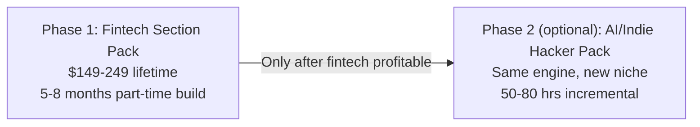

## Strategic thesis

Build a premium pack of React + Tailwind + Framer Motion landing-page sections scoped specifically to **fintech / financial SaaS**. Sold once for $149–249 lifetime, copy-paste delivery, no service component. Aceternity-model proven business shape, niche-first positioning to avoid the crowded general-purpose component market.

Your unfair advantages stacked together:

- **Fintech credibility** from your day job (must be wielded carefully — see Risk Gate below)
- **Design-system-grade taste** that the broader indie market can't match
- **AI-coding capable** so you can ship code-only without a dev partner
- **Specific niche** with no direct competitors selling fintech-only UI packs today

Verified business shape (real numbers from real solo founders):

- **Aceternity UI Pro** (Manu Arora, solo): $80k revenue in first 2 months, $199 lifetime, pure code, no Figma. [Source](https://www.starterstory.com/stories/aceternity-ui)
- **Tailwind Plus** (Adam Wathan): mid-7-figures/yr, $400k on launch day, pure code. [Source](https://adamwathan.me/journal/2020/12/29/2020-year-in-review/)
- **shipfast** (Marc Lou, solo): $1.2M lifetime, ~$20k/mo, pure code. [Source](https://newsletter.marclou.com/p/i-made-1-032-000-in-2025)

---

## RISK GATE: Employer Policy Check (DO THIS FIRST)

You're a VP at a major bank, building a fintech-adjacent product. **Do not write a single line of code until you've verified policy.** Specifically check your handbook + employment agreement for:

- Outside business / moonlighting clause — is it allowed at all?
- IP assignment — does the bank claim rights to anything design-related you create on personal time?
- Non-compete / non-solicitation — does it cover financial services broadly?
- Disclosure requirements — do you need written pre-approval from compliance/HR?
- Code of conduct rules around competing or adjacent businesses

Three branching outcomes:

1. **Policy permits fintech with proper structure** → form LLC, never publicly tie brand to your employer, never use proprietary patterns from your day job, never reference "VP at [bank]" in marketing → proceed with fintech as planned
2. **Policy ambiguous or prohibits fintech-adjacent** → pivot to **AI/indie-hacker pack as Phase 1 instead** (same model, same effort, no employer conflict). Keep fintech idea for "someday" or shelve permanently.
3. **Policy prohibits any outside business** → revisit entirely; possibly anonymous brand only, or different business model

If you have any doubt, **submit a written request to HR/Legal** for clarification. Phrase it carefully — something like: "I'd like to confirm I'm permitted to operate an unrelated digital products business on personal time." Do not mention fintech specifically until you know the lay of the land.

---

## Phase 1 — Fintech Landing Page Section Pack

This is the entire focus until shipped and earning. Everything else is distraction.

### What you're actually selling

- **One website** you own and design (`yourbrand.com`) — marketing pages, demos, component catalog, docs, pricing all on the same domain
- **Behind a $149–249 paywall**: a catalog of **30–35 fintech-specific page sections + components**, each with copy-paste React + Tailwind + Framer Motion code
- **One polished default look** using shadcn-compatible CSS variables (`--primary`, `--background`, `--ring`, etc.) — customers paste any shadcn theme and our components instantly re-skin. No multi-theme build effort on our end.
- **Lifetime access**, free updates for 12 months
- **Discord community** for low-touch peer support (optional, can be skipped)

Customer journey: land on your site → browse marketing/demos → click "Buy" → Lemon Squeezy overlay handles 30-second payment → instant return to your site with login → browse catalog → click "copy code" → paste into their Next.js project. **No service, no install, no white-glove.** Same shape as Aceternity.

### Architecture clarification

It's **one site experience**. Lemon Squeezy is just the payment layer (like Stripe Checkout) — it's not a second website. Customer's mental model is they were on your site the whole time.

### Component scope (locked, ~30–35 sections)

**Hero & top-of-page**
- 4 hero variants (split with screenshot, centered with product preview, video-led, animated stats)
- 3 trust-bar variants (regulators, partners, "as featured in" press)

**Product education**
- 3 "how it works" stepper variants
- 3 feature grid variants
- 2 product-screenshot showcases with annotations

**Trust & compliance (fintech-specific moat)**
- Compliance badge bar (PCI/SOC2/FDIC-style)
- Security feature showcase
- Testimonial sections with customer logos + role titles
- Press / "as featured in" bar

**Conversion & data**
- 3 pricing table variants (tiered, transparent fees, vs.-incumbents comparison)
- 2 ROI / savings calculator components
- Stats / metrics showcase
- 2 comparison tables (vs. traditional banking)

**Fintech-native components (the actual differentiator)**
- Animated debit-card mockup (4 styles)
- Transaction list preview
- Account-balance hero animation
- Mock dashboard preview block
- Chart-led section (Recharts under the hood)

**Footer & utility**
- 2 footer variants with regulatory-disclosure space
- FAQ accordion
- Newsletter signup
- App download CTA

That's the full list. Lock it. **Resist scope creep during build.**

### Tech stack

- **One Next.js app** containing marketing pages, component catalog, docs (via MDX), and embedded checkout — single domain, single deploy
- **Components**: React 19 + Tailwind v4 + Framer Motion + Radix UI primitives + CVA for variants
- **Icons**: Lucide (free, MIT, ~1,500 icons by Steve Schoger's team)
- **Theming**: shadcn-compatible CSS variables. Single polished default theme. Customers can drop in any shadcn theme to re-skin.
- **Hosting**: Railway (you already have an account)
- **Storefront**: Lemon Squeezy (handles tax/VAT, license keys, embedded checkout overlay — not a separate site)
- **Email**: Resend (transactional only — license keys, receipts; no marketing newsletter)
- **Analytics**: Plausible (privacy-friendly) or PostHog free tier
- **SEO tooling**: SEMrush or Ahrefs for keyword research and rank tracking
- **Build tooling**: Cursor + Claude as primary code authoring environment
- **No paid assets needed**: Lucide + Tailwind primitives + Framer Motion covers everything

### Pricing

- **Early-bird (first 50 buyers)**: $99 personal
- **Personal**: $149 lifetime
- **Team (5 seats)**: $349
- **Agency (unlimited)**: $799
- **Free updates** for 12 months; optional renewal at 50% off thereafter

### Effort, cash, timeline (concrete, revised for SEO-first model)

**Build effort (one-time):**
- Component design + code: ~100–150 hrs
- Marketing pages + catalog + docs (one Next.js app): ~40–60 hrs
- Storefront + checkout setup: ~5–10 hrs
- 10 long-form SEO articles (2–3 hrs each): ~25–30 hrs spread across build phase
- Niche validation + keyword research + brand setup: ~10 hrs
- **Total: ~180–260 hours. At 10 hrs/week → 4.5–6.5 months to launch.**

(Revised down ~30 hrs from v1 by dropping 5 brand themes and dropping social/build-in-public time.)

**Cash investment (upfront):**
- Domain: $15–30
- LLC formation: $200
- Cursor Pro (likely already paying): $20/mo
- Lemon Squeezy fees: 5% per transaction (no upfront)
- SEMrush or Ahrefs subscription for keyword research: $99–129/mo (cancel after launch + occasional re-subscribe for monitoring)
- Railway hosting: $5–20/mo
- **Realistic total: $400–800 upfront, ~$50/mo ongoing during active SEO work.**

**Ongoing effort post-launch:**
- Customer email support (license issues, etc.): 1–2 hrs/week
- Optional: 1 new SEO article per quarter (~3 hrs)
- Optional: rank monitoring + on-page SEO tweaks: ~2 hrs/quarter
- Optional: minor component updates / bug fixes: 2–4 hrs/month
- **Honest read: ~3–5 hrs/week to maintain. Closest thing to "passive" you'll get.**

**Revenue timeline (SEO-first mid-case projection):**
- Months 1–6 (build phase): $0
- **Launch month** (PH + HN one-time launches): $500–3k. Smaller than waitlist-led launches, but real. Both create permanent backlinks that boost SEO domain authority.
- Months 2–6 post-launch: $300–1.5k/month as articles index and rank
- Months 7–12: $1k–4k/month if SEO compounds and content ranks
- **Year 1 realistic total: $8k–30k**
- Year 2: $25k–70k as content matures and rankings settle. Compounds nicely with 1 article/quarter ongoing.
- Year 3+: stable $30–80k/yr passive if maintained, can be left to coast for months at a time

**Honest read on the SEO-first tradeoff**: lower year 1 ceiling vs. waitlist-led launches, but matches your "hands-off after build" preference. SEO compounds over years; social audiences decay. For someone who hates content creation and won't sustain it, SEO-first is the right call.

**Outlier ceiling**: Aceternity-level execution can hit $50–80k/month, but that's full-time effort + sustained Twitter audience. Explicitly not the plan.

---

## Distribution / Go-to-Market (SEO-first, hands-off after build)

The plan is **deliberately content-light and social-free**. SEO is the primary engine, and a one-time launch creates the initial spike + permanent backlinks. No newsletter, no Twitter campaign, no paid ads.

**During build (months 1–5):**
- **SEMrush keyword research** in week 1: identify 30–50 long-tail keywords with real search volume (e.g. "fintech landing page template", "neobank ui kit", "react crypto exchange components", "fintech onboarding flow design", "compliance bar component")
- **Write 10 long-form evergreen SEO articles** during the build phase (~2 articles/month, 2–3 hrs each). Topics drawn from your day-job knowledge:
  - "Designing a fintech onboarding flow"
  - "Compliance patterns for neobank landing pages"
  - "How to design a transaction list UI"
  - "Trust signals on fintech marketing pages"
  - "Pricing tables that work for SaaS fintech"
  - etc.
- Each article is published on the docs/blog section of your site, internally links to relevant components, ranks for years
- **No social media account, no newsletter, no audience-building work**

**Launch week (~5 hours total effort):**
- **Product Hunt launch** (Tuesday): submit, ping a few PH-active founders for upvotes. ~2 hrs effort. Even a modest PH ranking drives 1k–10k visitors and creates a permanent backlink.
- **Hacker News Show HN** post: one shot, well-written, only if a compelling angle. ~1 hr effort. Lottery ticket — most don't land but the ones that do drive 5k+ visitors.
- **Get listed in directories** (~1 hr): submit to `awesome-shadcn-ui`, `awesome-tailwindcss`, BetaList, awesome-fintech, etc. Free backlinks.
- **No email blast** (no waitlist to email).

**Post-launch (ongoing, ~4 hrs/quarter):**
- **1 new long-form article per quarter** (~3 hrs)
- **Rank monitoring** in SEMrush + minor on-page SEO tweaks (~1 hr/quarter)
- **Affiliate program** via Lemon Squeezy (30% commission) — set it up once, let bloggers/newsletter writers organically promote you
- **No active marketing.** SEO compounds in the background.

**Realistic search-traffic ramp:**
- Months 1–3 post-launch: articles indexing, minimal traffic
- Months 4–6: long-tail keywords start ranking, 500–2k organic visitors/month
- Months 7–12: 2k–10k organic visitors/month if content quality is good
- Year 2+: 10k–30k+ organic visitors/month as authority compounds

---

## Phase 2 — AI / Indie Hacker Pack (optional, only if Phase 1 succeeds)

If Phase 1 hits 100+ buyers within 6 months post-launch:

- Build a second pack: "AI Startup Launch Kit" — 25–35 sections specifically for AI/ML SaaS landing pages
- Reuses the same engine, themes, and storefront — only **50–80 hrs of incremental work**
- Cross-sell to existing buyers + new audience
- Bundle pricing: $249 for both packs vs. $149 each

**Do not build this until fintech is profitable.** The temptation to expand scope before validating is the most common failure mode in this category.

---

## Critical pre-work checklist (in order)

1. **Employer policy check** — read handbook, get HR/Legal clarification in writing if ambiguous (1–2 weeks)
2. **Niche validation** (~2 hrs):
   - SEMrush keyword volume scan around fintech UI / fintech components / neobank landing page / crypto exchange UI — confirm real search intent
   - ProductHunt + Indie Hackers competitor scan — confirm zero direct competitors
   - 5–10 founder DMs (Twitter or LinkedIn) asking "would you pay $199 for 30 fintech-specific landing page sections in React?" — confirm willingness-to-pay
3. **Brand identity decision** — pick product brand name (NOT your personal name, NOT referencing your employer). Working name examples: "Ledger Pattern", "Currency UI", "Stria", "Vault Sections", "Trust Kit"
4. **Legal setup** — file single-member LLC ($200), open business bank account, register domain
5. **Lock scope** — sign off on the 30–35 section list. Resist additions during build.

---

## Risks and mitigations

- **Employer conflict** (highest risk): handle via policy check upfront. If any doubt, pivot to AI/indie-hacker as Phase 1 instead.
- **SEO ramp slower than projected**: SEO is real but not instant. If 6 months post-launch you're at <$500/mo, options are (a) run one fintech newsletter sponsorship to inject traffic, or (b) accept the slower ramp and let content compound. Mitigate by writing genuinely useful articles that rank for high-intent commercial queries, not just informational ones.
- **Scope creep during build**: lock the 30-section list hard. New ideas go in a "v1.1" parking lot.
- **Underestimated build time**: assume 1.5x your initial estimate. If overrunning, cut scope (drop 5 sections) rather than push the launch.
- **Pricing too low**: $99 launch / $149 standard is conservative. Raise to $199–249 after launch with social proof.
- **Niche too narrow**: 5,000 fintech founders × 2% conversion × $249 = $25k. Niche math works. If demand validation step shows otherwise, broaden to "fintech + insurtech + wealth-tech" before launch.
- **No audience for launch spike**: this is the conscious tradeoff for going SEO-first. PH + HN one-time launches are the mitigation. If both flop, the SEO machine still works but year 1 revenue lands at the lower end of projections.

---

## What we'd ship in week 1 (after policy gate clears)

- Brand name finalized + domain registered
- LLC formation paperwork submitted
- Lemon Squeezy account opened
- One Next.js app scaffolded on Railway with marketing landing page live
- SEMrush keyword research complete (30–50 target long-tail keywords identified)
- 3 proof-of-concept components built (Hero, Pricing Table, Animated Debit Card) using Cursor
- First SEO article drafted (e.g. "Designing a fintech onboarding flow")

This is a 1-week sprint. From there, we move into the ~4.5–6.5-month build cadence at ~10 hrs/week.
